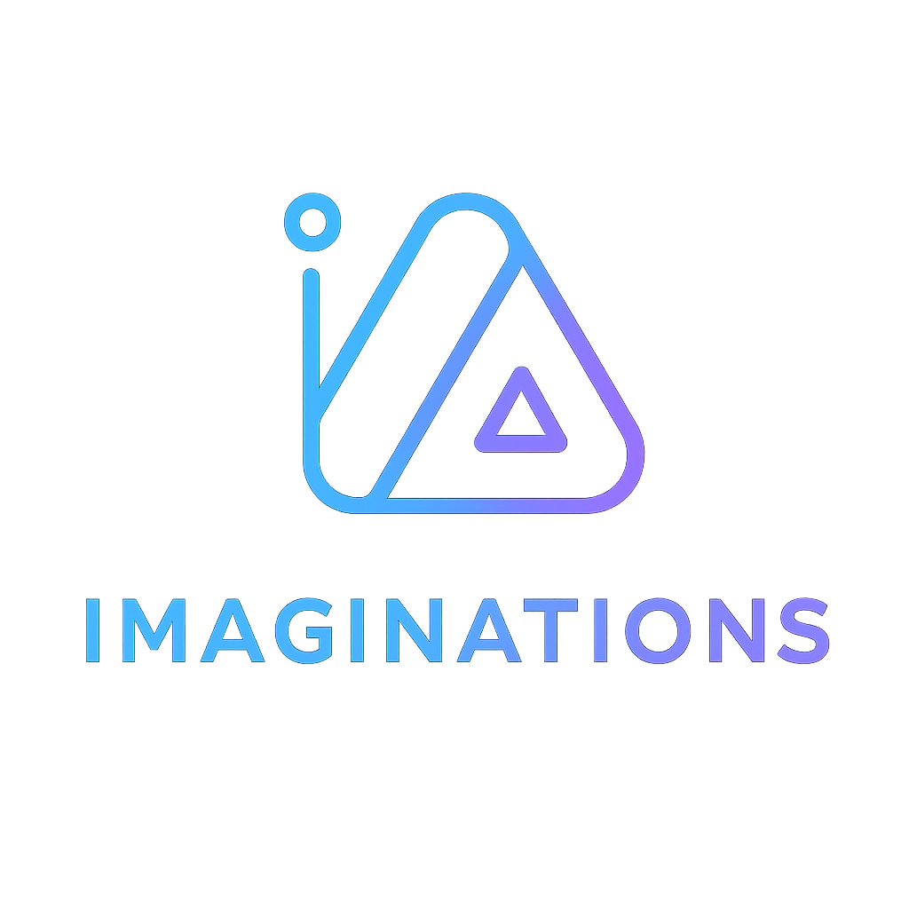

  

# 💫 About Me:
Hi. I build things before I fully understand them. Sometimes they work. Sometimes they turn into lessons.  I’m a junior software developer working across mobile, web Mostly focused on Flutter, but comfortable moving between frontend and automation when needed.  Into building real projects, automation, bots, and connecting systems that probably shouldn’t talk to each other. I care about learning by doing, writing cleaner code each time, and turning ideas into something usable.  Still learning. Still shipping.

## 🌐 Socials:
   

# 💻 Tech Stack:
 
        

# 📊 GitHub Stats:
 
 

### ✍️ Random Dev Quote

---

<!-- Proudly created with GPRM ( https://gprm.itsvg.in ) -->
